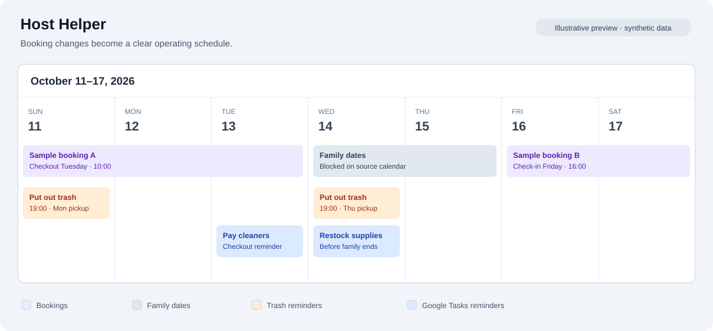
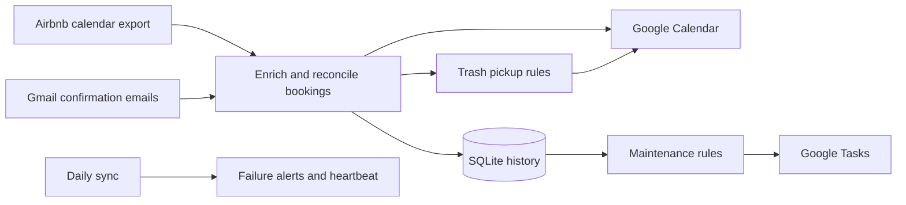

# Host Helper

[](https://github.com/Satoshilab21/host-helper/actions/workflows/ci.yml)


Host Helper turns a vacation rental's booking calendar into a daily operating schedule. It combines Airbnb's calendar export with reservation emails, synchronizes Google Calendar, and creates maintenance, payment tickets in in Google Tasks.

Built for a single property and a daily Linux cron job, the project addresses a practical problem: booking changes should update the schedule without creating duplicate events or reminders.

## Browser demo

Start with a standard calendar of Reserved entries, then choose Enrich to add invented guest details and identify Host blocked dates. You can also cancel a booking, extend a host block, or repeat a sync. The browser demo uses invented data and snapshots generated by the actual Python scheduling and reconciliation code. No account or installation is needed to try the published site.

The demo is prepared for GitHub Pages at `https://satoshilab21.github.io/host-helper/` after its first deployment. See [publishing and local preview instructions](docs/demo.md).



*Illustrative calendar preview using invented data; this is not a screenshot of a live account.*

## Features

- **Booking synchronization:** enriched reservation events with guest details, check-in/check-out times, and cancellation cleanup.
- **Blocked-date reconciliation:** family blocks retain their identity when Airbnb replaces or extends their feed identifiers; short near-term filler blocks are filtered.
- **Maintenance scheduling:** reminders based on checkout counts, occupied nights, and cooldowns rather than a fixed repeating calendar.
- **Duplicate control:** Calendar events use deterministic IDs; Tasks use stable notes markers and complete pagination, preserve completed copies, and clean duplicates in bounded batches.
- **Failure visibility:** escaped traceback details in a calendar alert, automatic alert cleanup after a successful run, and optional heartbeat monitoring.
- **Local state:** SQLite booking history keeps scheduling counters consistent across runs and preserves email details when an email is temporarily unavailable.

Cleaning-payment tasks are reminders. Host Helper does not process payments.

## How it works



Calendar synchronization runs first. Task rules then read the updated booking timeline. Counters are recomputed from history, so running the same sync again does not increment them a second time. See [architecture and design decisions](docs/architecture.md).

### Default scheduling rules

| Reminder | Trigger |
| --- | --- |
| Restock cleaning supplies | Every 5 guest checkouts; also 2 days before an eligible family block ends, resetting the checkout counter |
| Clean out the grill | At checkout after accumulating 30 guest nights; unused nights carry forward |
| Pay Cleaning Company | Each guest checkout, keyed to that specific stay |
| Check pool water level | On days already scheduled for restocking or grill maintenance |
| Check air filter | On the earliest eligible maintenance day, with a 30-day cooldown |
| Put out trash | Evening before Monday/Thursday pickup when at least 2 guest nights or a checkout have accumulated since the last scheduled pickup |

Maintenance tasks are generated for today and future dates. Payment reminders do not trigger pool or air-filter checks. Trash reminders are Calendar events; the other rules create Google Tasks.

## Getting started

Requirements: Python 3.11 or newer, an Airbnb calendar export URL, and a Google account with access to the destination calendar and reservation emails. CI is configured for Python 3.11, 3.12, and 3.13.

### 1. Install

```bash
git clone https://github.com/Satoshilab21/host-helper.git
cd host-helper
python3 -m venv .venv
source .venv/bin/activate
python -m pip install -e .
cp .env.example .env
```

On Windows, use `py -m venv .venv`, `.\.venv\Scripts\Activate.ps1`, and `Copy-Item .env.example .env` in place of the corresponding commands above.

Always run commands from the project directory. Configuration, OAuth tokens, and the database are resolved from the working directory.

### 2. Configure Google access

Create a Google Cloud project, enable the **Google Calendar API**, **Gmail API**, and **Google Tasks API**, and configure its OAuth consent screen. Create an OAuth client of type **Desktop app**, download its JSON, and save it as `credentials.json` in the project directory. If the consent screen is in testing mode, add the account you will authorize as a test user.

Host Helper uses Calendar event access, read-only Gmail access, and Tasks access. Separate tokens are cached as `token.json`, `token_gmail.json`, and `token_tasks.json`.

The Gmail account must receive the Airbnb confirmation emails. If you forward them to a dedicated mailbox, ensure Gmail search still finds the messages from `automated@airbnb.com`. Emails add details to feed reservations; the calendar feed remains the booking source.

See Google's [OAuth setup guide](https://developers.google.com/workspace/guides/create-credentials) and [consent configuration guide](https://developers.google.com/workspace/guides/configure-oauth-consent).

### 3. Configure the property

Edit `.env` and replace the `AIRBNB_ICS` placeholder with your private Airbnb calendar export URL. Set `TIMEZONE` to the property's IANA timezone, such as `America/New_York`. Keep the server's local timezone aligned with it because scheduling rules use the local date.

| Setting | Default | Purpose |
| --- | --- | --- |
| `AIRBNB_ICS` | Required | Private booking feed URL |
| `TIMEZONE` | `America/New_York` | Calendar event timezone |
| `CHECKIN_TIME` / `CHECKOUT_TIME` | `16:00` / `10:00` | Fallback times when email details are unavailable |
| `TASK_LIST_TITLE` | `Host Helper` | Destination Google Tasks list |
| `TRASH_OUT_TIME` | `19:00` | Reminder time on the evening before pickup |
| `HEALTHCHECK_URL` | Unset | Optional external heartbeat URL |

Rule thresholds, event colors, reminder lead times, and blocked-date filters are documented in [config.py](host_helper/config.py). Calendar events go to the authorized account's primary calendar.

### 4. Authorize and sync

```bash
python -m host_helper sync
```

On a desktop, the first sync opens browser authorization flows as needed. The sync writes to your Google Calendar and Tasks list. On a headless VPS, authorize through an SSH tunnel first; see the [deployment guide](docs/deployment.md).

After installation, `host-helper sync` is equivalent to `python -m host_helper sync`.

## Commands

```bash
host-helper --help
host-helper --version
host-helper sync
host-helper authorize
host-helper preview calendar
host-helper preview tasks
host-helper preview trash
host-helper deduplicate-cleaning --due-date 2026-10-13
host-helper deduplicate-cleaning --due-date 2026-10-13 --apply
```

Previews do not write Google events or tasks. `preview calendar` fetches the feed and Gmail and updates local booking state and token caches. `preview tasks` uses the local database without Google API calls. `preview trash` fetches the feed only. Preview output can contain personal information.

Duplicate cleanup previews exact cleaning-payment keys for the specified date. Adding `--apply` saves a private local backup before deleting extra copies. Normal sync also attempts bounded duplicate cleanup; quota-limited cleanup resumes on later runs.

## Development

```bash
python -m pip install -e ".[dev]"
python -m unittest discover -s tests -v
ruff check .
ruff format --check .
python -m build
pre-commit install
```

Tests use synthetic fixtures, in-memory databases, and mocked Google services. They run without `.env`, a calendar URL, OAuth credentials, or access to live accounts. Coverage includes block matching, email parsing, database rekeying, task pagination and duplicates, failure alerts, CLI startup, and legacy task-list migration.

GitHub Actions runs tests across Python 3.11–3.13, checks lint and formatting, builds the distribution, and scans Git history for secrets with Gitleaks. The commit hook provides an additional local secret check. See [contribution guidelines](CONTRIBUTING.md).

## Project layout

```text
host_helper/          Application package and CLI
tests/                Credential-independent regression tests
docs/                 Architecture, deployment, and illustrative assets
demo/                 Browser demo assets
scripts/              Build synthetic demo scenarios
.github/workflows/    Tests, lint, build, and secret scanning
pyproject.toml        Package metadata and dependency/tool configuration
.env.example          Placeholder configuration
run.py                Compatibility entry point for existing cron jobs
authorize.py          Compatibility entry point for existing OAuth commands
```

## Existing Open Manager installations

Keep the existing `open_manager.db`, `.env`, `credentials.json`, and OAuth token files when migrating. The database filename, stored task notes prefix `open_manager_key:`, and Calendar ID generation stay compatible with the original project.

When the default `Host Helper` Tasks list does not exist, sync reuses the existing `Open Manager` list and renames it without changing its ID or tasks. If both lists exist, the `Host Helper` list takes precedence. To keep the previous visible name, set `TASK_LIST_TITLE=Open Manager`.

Root-level `python run.py` and `python authorize.py` remain available for existing cron and authorization commands. Installation instructions and the recommended CLI now use Host Helper.

## Deployment and boundaries

The [Linux VPS guide](docs/deployment.md) covers authorization, cron, updates, logs, and migration. The application currently supports one property and one authorized account per working directory. It depends on the feed's refresh schedule and the confirmation-email format. Google Tasks due dates are day-based. Sync is not a transaction spanning SQLite and Google; after a partial failure, a later run reconciles available state. Avoid overlapping runs against the same state directory.

## Privacy

Keep deployment files and output private. The repository ignores credentials, tokens, feed exports, logs, databases, and backups. All published examples and calendar artwork use invented data. Follow [SECURITY.md](SECURITY.md) before publishing changes or reporting an issue.
